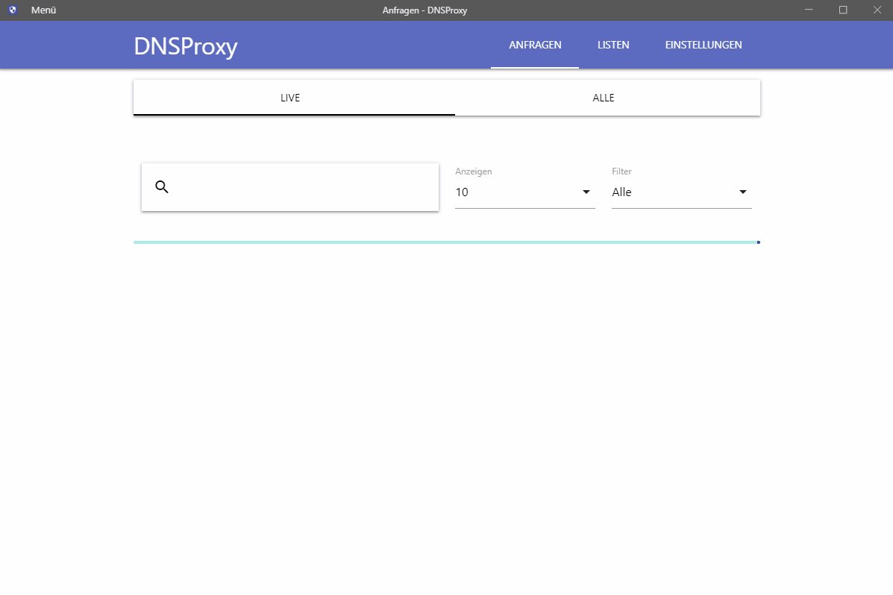
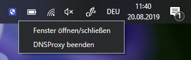
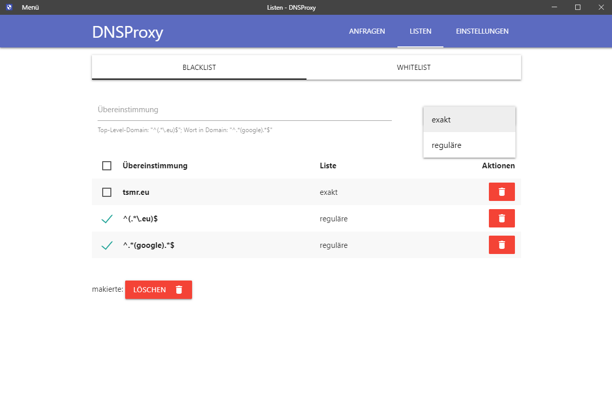
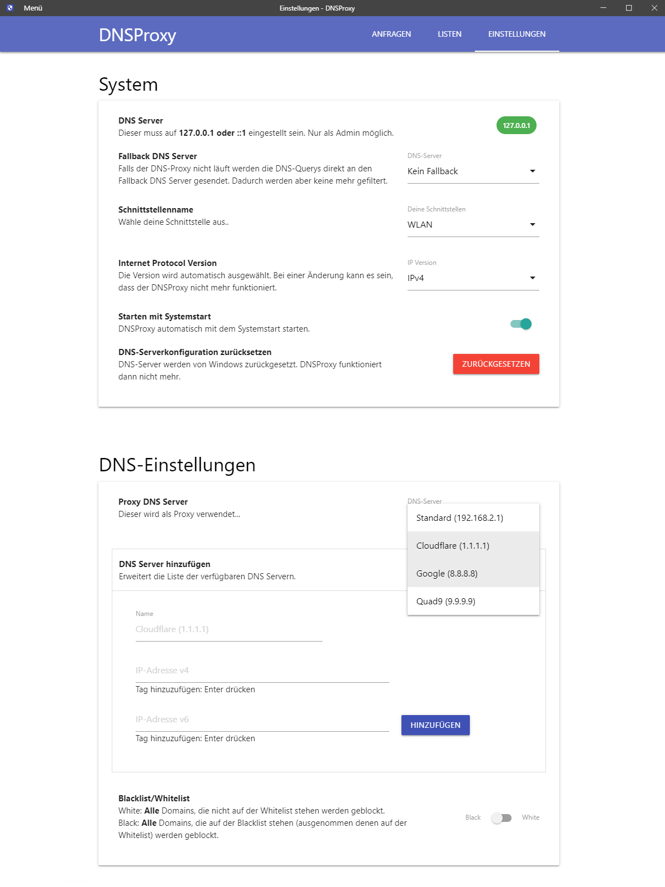

# DNSProxy
Eine einfache Möglichkeit Domains unter **Windows** zu blockieren und alle DNS-Anfragen mitzuschneiden.





# Get Started


Die Datei [**DNSProxySetup.exe**](https://github.com/otsmr/dnsproxy/releases/tag/v1.0-beta) herunterladen und installieren. Das Programm wird nach der Installation minimiert geöffnet. Die GUI kann man über das TrayIcon öffnen.



## GUI

## Black-/Whitelist



## Einstellungen




# Development
```
git clone https://github.com/otsmr/dnsproxy.git
npm install
npm start
```

## Build
```
npm run dist
```

# Regex

**TOP-Level-Domain**: ^(.\*\\.eu)$  
**Match Word**: ^.\*(google).\*$

# License

[MIT](https://github.com/otsmr/dnsproxy/blob/master/LICENSE) (c) tsmr
